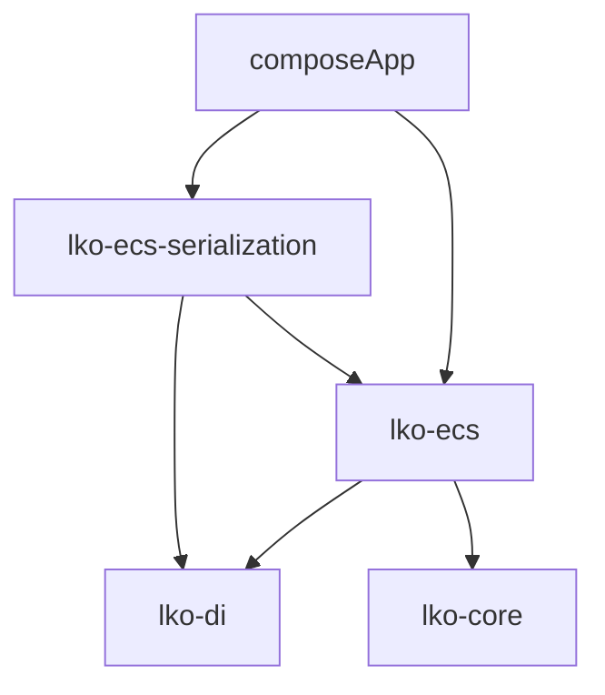

# 宗门修真录 - 整体架构

**最后更新**: 2026-02-14
**项目类型**: Kotlin Multiplatform ECS 游戏框架
**入口点**: composeApp/src/commonMain/kotlin/cn/jzl/sect/App.kt

## 项目概览

```
sect/
├── libs/                          # 核心库
│   ├── lko-core/                  # 基础工具库 (集合/位运算)
│   ├── lko-di/                    # 依赖注入框架
│   ├── lko-ecs/                   # ECS 框架核心
│   └── lko-ecs-serialization/     # ECS 序列化
├── business-modules/              # 业务模块 (待实现)
│   ├── business-core/             # 核心业务
│   ├── business-disciples/        # 弟子系统
│   ├── business-cultivation/       # 修炼系统
│   ├── business-quest/            # 任务系统
│   └── business-engine/           # 游戏引擎
├── composeApp/                    # 应用主模块
├── androidApp/                    # Android 应用
└── benchmarks/                    # 性能基准测试
```

## 模块依赖关系



| 模块 | 依赖 | 说明 |
|------|------|------|
| lko-ecs | lko-di, lko-core | ECS 框架核心 |
| lko-ecs-serialization | lko-ecs, lko-di | 序列化扩展 |
| composeApp | lko-ecs, lko-ecs-serialization | 应用入口 |

## 核心概念

### ECS (Entity Component System)

- **Entity**: 实体，游戏的游戏对象
- **Component**: 组件，存储数据的结构
- **System**: 系统，处理逻辑

### 关键特性

1. **Archetype-based**: 基于原型的高效内存布局
2. **Relation System**: 实体关系系统 (父子/实例)
3. **Query System**: 强大的查询系统
4. **Observer Pattern**: 观察者模式的事件系统
5. **Serialization**: 完整的序列化支持

## 导出 API

### ECS 框架

```kotlin
// 创建世界
val world = world { }

// 创建实体
val entity = world.entity {
    it.addComponent(Position(0, 0))
    it.addComponent(Health(100, 100))
}

// 查询实体
world.query { Context(this) }.forEach { ctx ->
    println(ctx.position)
}

// 观察事件
world.observe {
    onEntityCreated { entity -> ... }
}
```

### 依赖注入

```kotlin
val di = DI {
    bind singleton { MyService() }
    bind factory { Config(it) }
}
```

## 技术栈

| 类别 | 技术 |
|------|------|
| 语言 | Kotlin 1.9.x |
| 目标平台 | JVM, Android, JS, WasmJS |
| 构建 | Gradle 8.x (Kotlin DSL) |
| 测试 | Kotlin Test |

## 相关文档

- [ECS 架构详解](ecs-architecture.md)
- [依赖注入](docs/lko-di.md) - 内部文档
- [游戏需求文档](docs/文字游戏需求文档_GRD.md)
